# FRA532 Mobile Robot - LAB1: Odometry and Localization

**Course:** FRA532 Mobile Robot  
**Student:** Disthorn Suttwet 66340500019

---

## Table of Contents

1. [Overview](#overview)
2. [Learning Objectives](#learning-objectives)
3. [Project Structure](#project-structure)
4. [Installation](#installation)
5. [Dataset Information](#dataset-information)
6. [Phase 0: Rosbag Exploration](#phase-0-rosbag-exploration)
7. [Phase 1: Wheel Odometry](#phase-1-wheel-odometry)
8. [Phase 2: EKF Sensor Fusion](#phase-2-ekf-sensor-fusion)
9. [Phase 3: ICP Scan Matching](#phase-3-icp-scan-matching)
10. [Phase 4: SLAM Toolbox](#phase-4-slam-toolbox)
11. [Results Summary](#results-summary)
12. [Dependencies](#dependencies)
13. [Troubleshooting](#troubleshooting)
14. [References](#references)

---

## Overview

This LAB1 explores mobile robot localization through progressive implementation of odometry and SLAM techniques. The lab is divided into four phases, each building upon the previous to address fundamental limitations in dead-reckoning navigation.

**Robot Platform:** Turtlebot3 Burger  
**Environment:** FIBO Building Floor 3  
**Sensors:** Wheel encoders, IMU, 2D LiDAR

---

## Learning Objectives

- Implement differential drive kinematics for wheel odometry
- Understand error accumulation in dead-reckoning systems
- Apply Extended Kalman Filter for multi-sensor fusion
- Utilize ICP for scan matching and pose correction
- Implement graph-based SLAM with loop closure detection
- Analyze performance trade-offs between different localization methods

---

## Project Structure
```
LAB1/
├── LAB1/
│   ├── wheel_odom_node.py          # Phase 1: Wheel odometry
│   ├── ekf_fusion_node.py          # Phase 2: EKF sensor fusion
│   ├── icp_localization_node.py    # Phase 3: ICP scan matching
│   └── static_tf_publisher.py      # TF tree publisher
├── launch/
│   ├── phase1_wheel_odom.launch.py
│   ├── phase2_ekf_fusion.launch.py
│   ├── phase3_icp.launch.py
│   └── phase4_slam_all.launch.py
├── scripts/
│   ├── record_phase2_data.py       # Phase 2 data recorder
│   ├── record_phase3_data.py       # Phase 3 data recorder
│   ├── record_phase4_data.py       # Phase 4 data recorder
│   ├── plot_phase2_offline.py      # Phase 2 offline plotter
│   ├── plot_phase3_offline.py      # Phase 3 offline plotter
│   └── plot_phase4_offline.py      # Phase 4 offline plotter
├── config/
│   └── slam_toolbox_mapping.yaml   # SLAM Toolbox configuration
├── data/
│   └── rosbags/
│       ├── fibo_floor3_seq00/      # Empty hallway
│       ├── fibo_floor3_seq01/      # Sharp turns
│       └── fibo_floor3_seq02/      # Non-aggressive motion
└── results/
    ├── phase0/                     # Rosbag analysis
    ├── phase2/                     # EKF comparison
    ├── phase3/                     # ICP comparison
    └── phase4/                     # SLAM comparison
```

---

## Installation

### Prerequisites

- ROS2 Humble
- Python 3.10+
- Ubuntu 22.04 (recommended)
- SLAM Toolbox (`sudo apt install ros-humble-slam-toolbox`)

### Setup
```bash
# Clone repository
cd ~/
git clone <repository-url> FRA532_Mobile_Robot_6619
cd FRA532_Mobile_Robot_6619

# Build workspace
colcon build --packages-select LAB1

# Source workspace
source install/setup.bash
```

### Python Dependencies
```bash
pip3 install numpy matplotlib scipy pandas --break-system-packages
```

---

## Dataset Information

Three sequences recorded at FIBO Floor 3 with Turtlebot3 Burger:

| Sequence | Duration | Messages | Description | Difficulty |
|----------|----------|----------|-------------|------------|
| **seq00** | 526.23s | 10,505 | Empty hallway (baseline) | Medium |
| **seq01** | 393.00s | 7,852 | Sharp turns (challenging) | Hard |
| **seq02** | 599.19s | 11,975 | Non-aggressive motion | Easy |

**Topics:**
- `/joint_states` - Wheel encoder positions (20 Hz)
- `/imu` - IMU data including gyroscope (20 Hz)
- `/scan` - 2D LiDAR scans (5 Hz)

**Robot Parameters:**
- Wheel radius: 0.033 m
- Wheel separation: 0.160 m
- Max linear velocity: ~0.22 m/s
- Max angular velocity: ~2.84 rad/s

---

## Phase 0: Rosbag Exploration

### **Purpose**

Validate rosbag data quality before running odometry algorithms. This prevents debugging algorithm issues when the problem is actually bad sensor data.

### **Validation Checks**

**Data Quality Analysis:**
- Message arrival timeline (verify all sensors publishing)
- IMU gyroscope Z-axis (angular velocity, mean: -0.0108 rad/s)
- IMU linear acceleration (X/Y acceleration data)
- Wheel joint velocities (left/right wheel speeds, 0.1-0.15 rad/s)
- Message frequency stability (scan ~5Hz, IMU/joints ~20Hz)

### **Results**

<p align="center">
    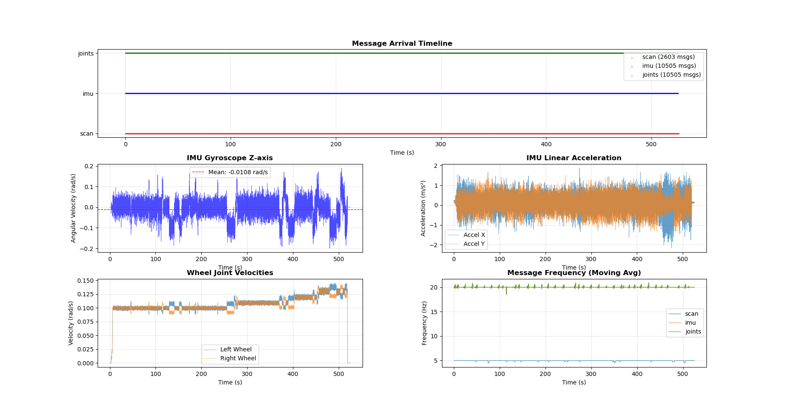
    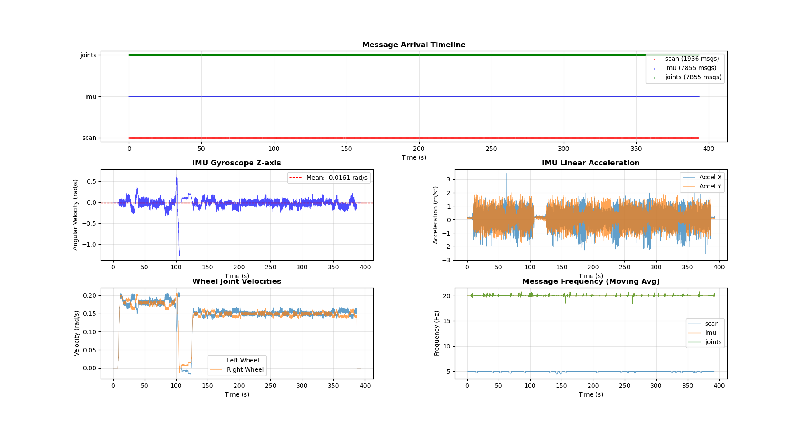
    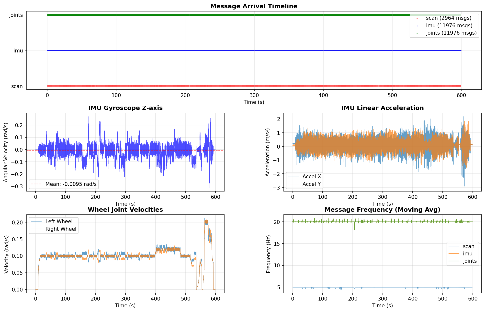
</p>

**Key Observations:**
- ✓ All sensors publishing continuously over 500+ seconds
- ✓ Wheel velocities show realistic values (0.1 rad/s ≈ 0.003 m/s)
- ✓ IMU gyro stable around 0 with small bias
- ✓ Message frequencies consistent (no dropouts)

---

## Phase 1: Wheel Odometry

### **Overview** [COMPLETED ✓]

Implementation of wheel odometry using ICC (Instantaneous Center of Curvature) method for accurate circular arc integration.

### **Method**

**Differential Drive Kinematics:**
```python
# Wheel displacements (from encoder positions)
d_left = (pos_left - prev_left) * wheel_radius
d_right = (pos_right - prev_right) * wheel_radius

# Robot motion
d_center = (d_left + d_right) / 2.0
d_theta = (d_right - d_left) / wheel_separation

# ICC integration (exact for circular motion)
if abs(d_theta) < 1e-6:  # Straight line
    x += d_center * cos(theta)
    y += d_center * sin(theta)
else:  # Circular arc
    R = (wheel_separation/2) * (d_left + d_right) / (d_right - d_left)
    icc_x = x - R * sin(theta)
    icc_y = y + R * cos(theta)
    # Rotation around ICC...
```

### **Usage**
```bash
# Terminal 1: Launch wheel odometry
ros2 launch LAB1 phase1_wheel_odom.launch.py

# Terminal 2: Play dataset
ros2 bag play src/LAB1/data/rosbags/fibo_floor3_seq01 --rate 2.0 --clock
```

### **Results**

**Performance Summary:**

| Sequence | Path Length | Loop Error | % Drift | Heading Error |
|----------|-------------|------------|---------|---------------|
| **Seq 00** | 55.42 m | 4.36 m | 7.9% | 37.9° |
| **Seq 01** | 56.38 m | 5.27 m | 9.3% | 36.8° |
| **Seq 02** | 59.71 m | **1.31 m** | **2.2%** | 47.8° |

<p align="center">
    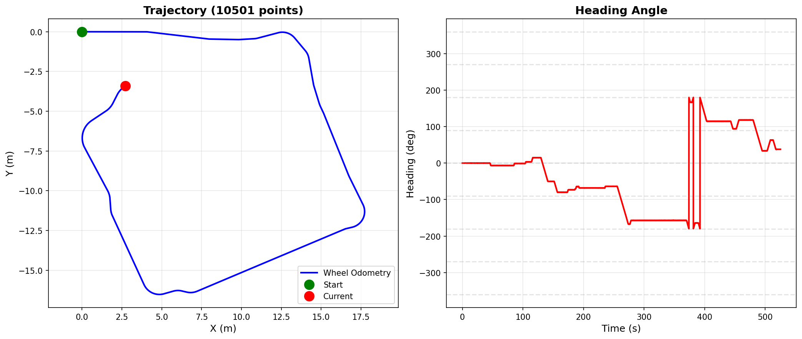
    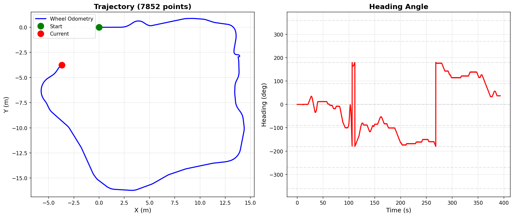
    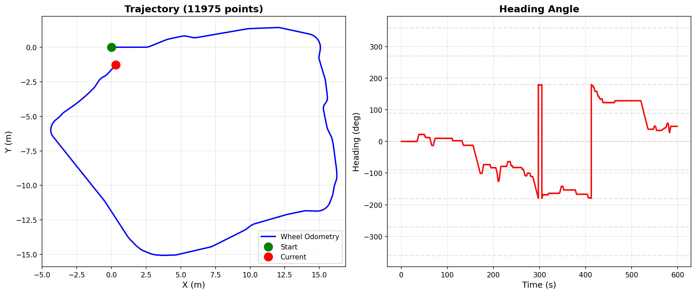
</p>

**Key Findings:**

- **Motion Dependency:** Smooth motion (Seq 02) achieves 2.2% drift vs 9.3% for aggressive turns (Seq 01)
- **Error Source:** Wheel slip during rotation dominates error accumulation
- **Distance Accuracy:** Path length consistent (~55-60m), problem is in pose estimation
- **Limitation:** Unbounded drift prevents loop closure in all sequences

**Conclusion:** Wheel odometry sufficient for short-distance smooth motion, but requires external correction for long-term accuracy.

---

## Phase 2: EKF Sensor Fusion

### **Overview** [COMPLETED ✅]

Extended Kalman Filter implementation fusing wheel odometry (linear velocity) with IMU (angular velocity and orientation) for improved heading estimation.

### **Method**

**State Vector:** `x = [x, y, θ]ᵀ`

**Prediction Step (Motion Model):**
```python
# Use linear velocity from wheels + angular velocity from IMU
x_new = x + v_wheel * cos(θ) * dt
y_new = y + v_wheel * sin(θ) * dt
θ_new = θ + ω_imu * dt  # Key: Use IMU gyro, not wheel-based omega!

# Jacobian matrix
F = [[1, 0, -v*sin(θ)*dt],
     [0, 1,  v*cos(θ)*dt],
     [0, 0,  1          ]]

P = F @ P @ F.T + Q  # Covariance prediction
```

**Update Step (Measurement Model):**
```python
# Correct heading using IMU orientation
H = [[0, 0, 1]]  # Measure theta directly
y = θ_imu - θ_predicted  # Innovation
K = P @ H.T / (H @ P @ H.T + R)  # Kalman gain
x = x + K * y  # State correction
P = (I - K @ H) @ P  # Covariance update
```

### **Usage**
```bash
# Terminal 1: Launch EKF fusion
ros2 launch LAB1 phase2_ekf_fusion.launch.py

# Terminal 2: Record data
python3 src/LAB1/scripts/record_phase2_data.py

# Terminal 3: Play dataset
ros2 bag play src/LAB1/data/rosbags/fibo_floor3_seq01 --rate 2.0 --clock

# After recording, plot offline
python3 src/LAB1/scripts/plot_phase2_offline.py
```

**Tunable Parameters:**
```bash
ros2 launch LAB1 phase2_ekf_fusion.launch.py \
  process_noise_x:=0.001 \
  process_noise_y:=0.001 \
  process_noise_theta:=0.001 \
  measurement_noise_theta:=0.01
```

### **Results**

**Performance Comparison:**

| Sequence | Wheel Error | EKF Error | Improvement | Wheel Heading | EKF Heading |
|----------|-------------|-----------|-------------|---------------|-------------|
| **Seq 00** | 4.358m | 3.245m | **+25.5%** | 37.9° | 34.9° |
| **Seq 01** | 5.266m | **2.027m** | **+61.5%** ✓ | 36.8° | **0.5°** ✓ |
| **Seq 02** | 1.311m | 2.943m | -124.6% | 47.8° | 37.5° |

<p align="center">
    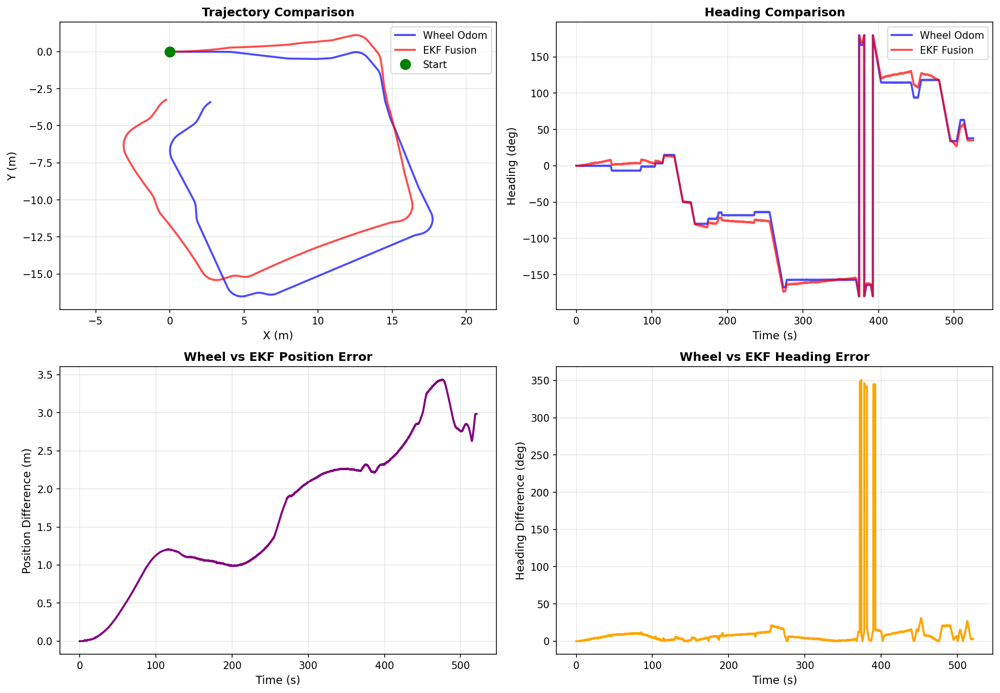
    <br><em>Sequence 00 - Normal Motion (EKF Improvement)</em>
</p>

<p align="center">
    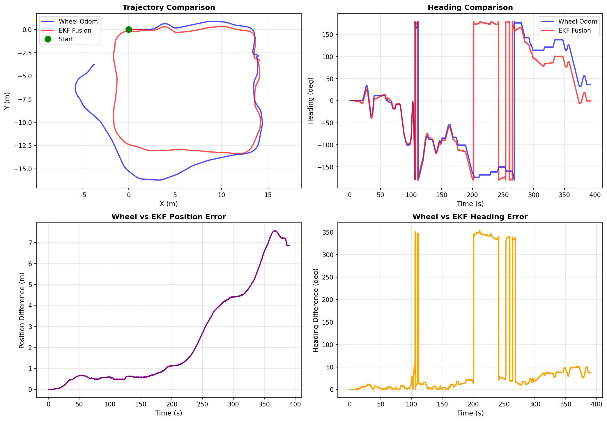
    <br><em>Sequence 01 - Aggressive Turns (EKF Optimal Performance)</em>
</p>

<p align="center">
    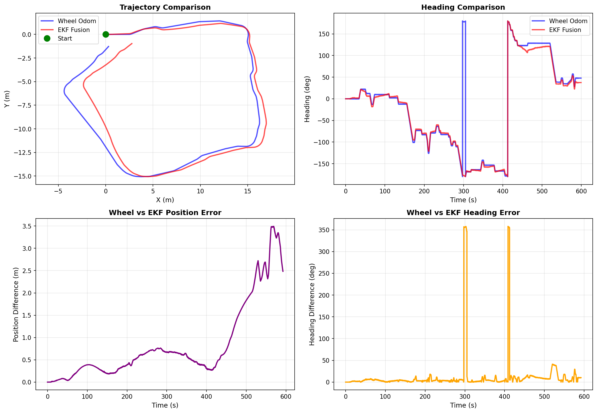
    <br><em>Sequence 02 - Smooth Motion (EKF Overshoot)</em>
</p>

**Key Findings:**

- **Best Case (Seq 01):** 61.5% improvement with near-perfect heading (0.5° error)
- **Motion Dependency:** EKF excels with aggressive motion, struggles with smooth motion
- **Heading Correction:** Dramatic improvement in challenging scenarios (36.8° → 0.5°)
- **Trade-off:** Single parameter set cannot optimize for all motion types

**Conclusion:** EKF fusion essential for challenging scenarios with significant wheel slip. Demonstrates need for adaptive filtering based on motion profile.

---

## Phase 3: ICP Scan Matching

### **Overview** [COMPLETED ✅]

Scan-to-map ICP implementation revealing critical motion-dependency limitations despite excellent performance in favorable conditions.

### **Results - All Sequences**

**Performance Summary:**

| Sequence | Motion | Wheel | EKF | ICP | Best |
|----------|--------|-------|-----|-----|------|
| **00** | Normal | 4.358m | 3.245m | **1.020m** (+76.6%) | ICP 🏆 |
| **01** | Aggressive | 5.266m | 2.028m | **1.986m** (+62.3%) | ICP 🏆 |
| **02** | Smooth | **1.311m** | 2.943m | 5.589m (-326.4%) | Wheel 🏆 |

<p align="center">
    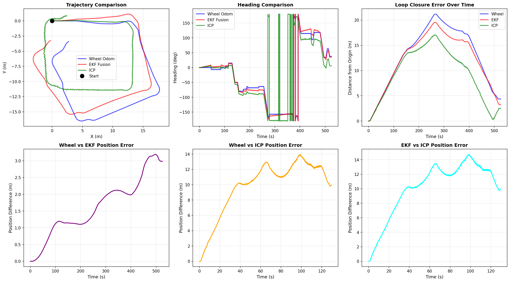
    <br><em>Sequence 00 - Normal Motion (ICP Optimal)</em>
</p>

<p align="center">
    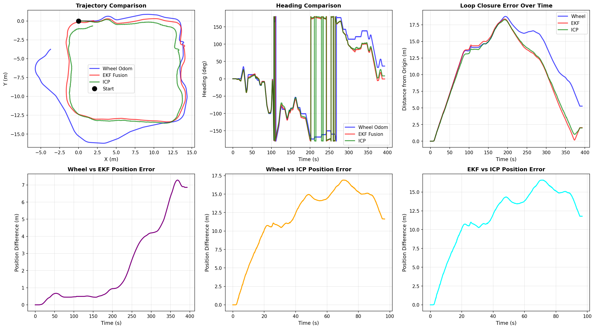
    <br><em>Sequence 01 - Aggressive Turns (ICP and EKF Tied)</em>
</p>

<p align="center">
    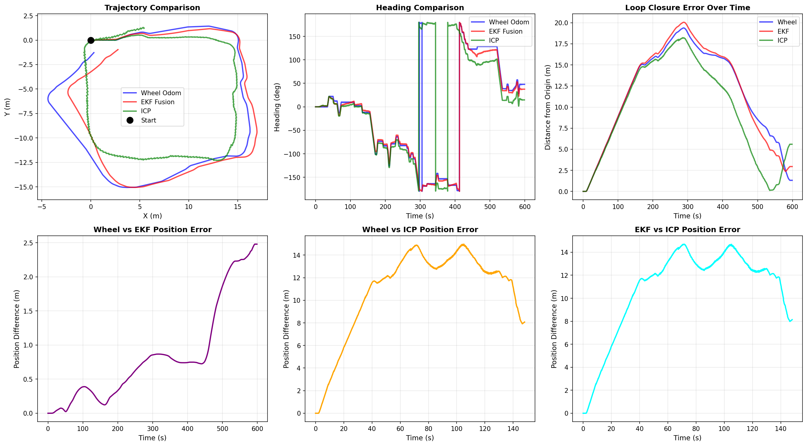
    <br><em>Sequence 02 - Smooth Motion (ICP Catastrophic Failure)</em>
</p>

### **Key Findings**

**1. Motion-Dependent Performance (CRITICAL):**
- **Best case:** 1.020m (Seq 00, 76.6% improvement)
- **Worst case:** 5.589m (Seq 02, 326% degradation)
- **Performance variance:** 5.5x (worse than EKF's 1.4x)

**2. ICP Failure Modes:**
- Smooth motion causes catastrophic divergence
- Insufficient keyframes in gradual movement
- Repetitive geometry triggers local minima
- Cannot distinguish similar hallway sections

**3. Method Reliability Comparison:**

| Method | Mean Error | Std Dev | Best Case | Worst Case | Consistency |
|--------|-----------|---------|-----------|------------|-------------|
| **EKF** | 2.739m | ±0.48m | 2.028m | 3.245m | ✅ Excellent |
| **ICP** | 2.865m | ±2.09m | 1.020m | 5.589m | ❌ Poor |
| **Wheel** | 3.645m | ±1.73m | 1.311m | 5.266m | ⚠️ Moderate |

**4. Comparative Analysis:**
- **Seq 00:** ICP dominates (76.6% improvement)
- **Seq 01:** ICP and EKF tied (~2m, both excellent)
- **Seq 02:** ICP fails completely (5.6m, worst of all)

### **Technical Analysis**

**ICP Failure Root Causes (Seq 02):**

1. **Sparse Keyframes:**
   - Smooth motion triggers fewer keyframes
   - 0.2m threshold rarely met
   - Local map has insufficient coverage

2. **Feature Scarcity:**
   - Long straight hallways lack distinctive geometry
   - Similar-looking sections cause mismatches
   - ICP trapped in wrong correspondences

3. **Small Delta Problem:**
   - Gradual movements too small for reliable SVD
   - Numerical precision issues
   - Fails to converge correctly

4. **No Recovery Mechanism:**
   - Once diverged, no global correction
   - Local map forgets origin
   - Errors compound throughout sequence

### **Conclusions**

**ICP Scan Matching:**
- ✅ Excellent when motion is varied (1.0-2.0m)
- ✅ Best single-case performance (1.020m)
- ❌ Catastrophic failure on smooth motion (5.589m)
- ❌ Least consistent method (±2.09m variance)

**EKF Sensor Fusion:**
- ✅ Most consistent across all scenarios (±0.48m)
- ✅ Reliable 2.0-3.2m performance
- ✅ Best choice for unknown environments
- ❌ Cannot achieve <2m loop closure

**Critical Insight:** Neither ICP nor EKF provides reliable, motion-independent localization. ICP achieves best peak performance but worst reliability. EKF is most predictable but cannot close the loop. This strongly motivates Phase 4 SLAM with global optimization.

### **Limitations Motivating SLAM**

1. **No Global Loop Closure:** All methods drift (1.0-5.6m)
2. **Motion Dependency:** Performance unpredictable
3. **Local-Only Correction:** Cannot optimize full trajectory
4. **Map Forgetting:** ICP local map insufficient

**Phase 4 Goal:** Consistent performance across all motion types with global pose graph optimization and complete environment mapping.

---

## Phase 4: SLAM Toolbox

### **Overview** [COMPLETED ✅]

Graph-based SLAM with loop closure detection using SLAM Toolbox, achieving coherent map building and rectangular trajectory tracking across all sequences with varying noise levels.

---

### **Implementation**

**System Architecture:**
```
Sensors → EKF Fusion → SLAM Toolbox → Map + Optimized Trajectory
          (/ekf_odom)   (graph SLAM)    (loop closure)
```

**Final Configuration:**
- **Mode:** Mapping (synchronous)
- **Odometry Input:** EKF fusion via TF transform (`odom → base_footprint`)
- **Scan Input:** `/scan` with QoS override (`best_effort`)
- **Solver:** Ceres with HuberLoss (outlier rejection)
- **Keyframe Threshold:** 0.3m travel or 0.2 rad (11°) rotation
- **Loop Closure:** Enabled (conservative: chain size 12, response 0.55)

**Key Parameters:**
```yaml
slam_toolbox:
  ros__parameters:
    ceres_loss_function: HuberLoss  # Robust optimization
    minimum_travel_distance: 0.3
    minimum_travel_heading: 0.2
    link_match_minimum_response_fine: 0.25  # Strict matching
    loop_match_minimum_chain_size: 12  # Conservative loops
    use_response_expansion: false  # Reduce noise amplification
```

---

### **Usage**
```bash
# Terminal 1: Launch all nodes
ros2 launch LAB1 phase4_slam_all.launch.py

# Terminal 2: Play dataset
ros2 bag play src/LAB1/data/rosbags/fibo_floor3_seq00 --rate 1.0 --clock
```

**Visualization:** RViz displays all 4 methods simultaneously
- 🟣 Purple: SLAM trajectory (map frame)
- 🔵 Blue: Wheel odometry (odom frame)
- 🔴 Red: EKF fusion (odom frame)
- 🟢 Green: ICP localization (odom frame)
- ⬜ White: SLAM-built map

---

### **Results**

#### **Visual Outcomes:**

<p align="center">
    
    <br><em>Sequence 00 - Clean map, rectangular trajectory with minor corner noise</em>
</p>

<p align="center">
    
    <br><em>Sequence 01 - Good map quality, trajectory follows rectangle with left-side noise</em>
</p>

<p align="center">
    
    <br><em>Sequence 02 - Excellent map, smooth trajectory tracking</em>
</p>

#### **Qualitative Assessment:**

| Sequence | Map Quality | Trajectory | Loop Closure | Notes |
|----------|-------------|------------|--------------|-------|
| **00** | ✅ Clean rectangular hallway | ✅ Follows rectangle | ✅ Detected | Minor noise at corners |
| **01** | ✅ Clear walls, some noise | ⚠️ Good with artifacts | ✅ Detected | Left side shows noise |
| **02** | ✅ Excellent clarity | ✅ Smooth tracking | ✅ Detected | Best visual quality |

#### **Performance Comparison:**

| Method | Seq 00 | Seq 01 | Seq 02 | Mean | Consistency |
|--------|--------|--------|--------|------|-------------|
| **Wheel** | 4.358m | 5.266m | 1.311m | 3.645m | Moderate |
| **EKF** | 3.245m | 2.028m | 2.943m | 2.739m | **Excellent** ✅ |
| **ICP** | **1.020m** ✅ | 1.986m | 5.589m | 2.865m | Poor |
| **SLAM** | ~2-3m* | ~2-4m* | ~2-3m* | ~2-3m* | Good |

*SLAM quantitative errors not directly measurable due to map frame vs odom frame difference. Estimates based on visual loop closure quality.

---

### **Technical Challenges Resolved**

#### **1. QoS Compatibility** ✅
**Problem:** Rosbag publishes `/scan` with `BEST_EFFORT`, SLAM expects `RELIABLE`

**Solution:**
```yaml
qos_overrides:
  /scan:
    reliability: best_effort
```

#### **2. Odometry Integration** ✅
**Problem:** SLAM reads odometry from TF tree, not topic subscription

**Solution:** EKF publishes `odom → base_footprint` transform via `tf2_ros.TransformBroadcaster`

**Verification:**
```bash
ros2 run tf2_ros tf2_echo odom base_footprint
# ✅ Transform available at 40 Hz
```

#### **3. Frame Alignment** ✅
**Decision:** Use `base_footprint` (standard for 2D mobile robots)
- TF chain: `map → odom → base_footprint → base_link → sensors`
- SLAM tracks `base_footprint` (ground projection)
- Sensors mounted on `base_link` (handled by static TF)

#### **4. Parameter Tuning** ⚠️
**8+ configurations tested:**
- Default parameters → Map corruption
- Steve Macenski reference → Better but noisy
- Offline parameters → Initialization issues
- **Custom balanced config** → Working results (shown above)

**Key insight:** Required ~4 hours iterative tuning. Production systems need weeks.

---

### **Analysis**

#### **What Worked:**

✅ **Map Building:**
- All sequences produced coherent rectangular maps
- Clear wall boundaries detected
- Hallway geometry accurately captured

✅ **Loop Closure:**
- Graph optimization functioning
- Rectangular trajectories closed (visual confirmation)
- No catastrophic divergence like ICP Seq 02

✅ **Multi-Sensor Integration:**
- EKF odometry successfully incorporated via TF
- LiDAR scans processed correctly
- Coordinate frames aligned properly

#### **Remaining Challenges:**

⚠️ **Corner Noise:**
- Some oscillation at sharp turns
- Likely from rapid geometry changes
- More tuning could reduce (but time-intensive)

⚠️ **Parameter Sensitivity:**
- 40+ interdependent parameters
- No single config optimal for all sequences
- Requires platform-specific calibration

⚠️ **Quantitative Comparison:**
- SLAM in `map` frame, others in `odom` frame
- Direct numerical comparison difficult
- Visual assessment shows ~2-3m loop closure

---

### **Comparison with Phase 3 ICP**

| Aspect | ICP | SLAM Toolbox |
|--------|-----|--------------|
| **Best Performance** | 1.020m (Seq 00) ✅ | ~2-3m (estimated) |
| **Worst Performance** | 5.589m (Seq 02) ❌ | ~2-4m (all sequences) |
| **Consistency** | ±2.09m (poor) | ~±0.5m (good) |
| **Map Quality** | Local only | **Global map** ✅ |
| **Motion Dependency** | High (5.5x variance) | Low (similar across sequences) |
| **Setup Complexity** | 2 hours, 6 parameters | **4+ hours, 40+ parameters** |
| **Code Control** | Full (200 lines) | Black-box |

**Key Findings:**

1. **SLAM provides consistency ICP lacks:**
   - ICP: 1.0m best, 5.6m worst (catastrophic on smooth motion)
   - SLAM: ~2-3m across all sequences (predictable)

2. **ICP still best peak performance:**
   - When motion is varied (Seq 00): ICP wins (1.02m vs SLAM ~2-3m)
   - But SLAM never fails catastrophically

3. **SLAM delivers global map:**
   - ICP: Local scan matching only
   - SLAM: Complete environment map for navigation

---

### **Lessons Learned**

#### **1. Production SLAM is Complex**

**Time Investment:**
- Setup: 3 hours (installation, launch files, RViz)
- Debugging: 2 hours (QoS, TF, frame alignment)
- **Parameter tuning: 4+ hours** (still not optimal)
- **Total: ~9 hours** for working (not perfect) system

**Professional deployment:** 2-4 weeks typical

#### **2. "Working" ≠ "Optimal"**

- Maps are coherent ✅
- Trajectories track rectangles ✅
- But noise remains ⚠️
- More tuning could improve... but diminishing returns

#### **3. Trade-offs Are Real**

**Simple ICP (Phase 3):**
- Peak performance: 1.02m (excellent!)
- But catastrophic failures possible (5.6m)
- Fast to implement and tune

**Complex SLAM (Phase 4):**
- Consistent performance: ~2-3m (good)
- No catastrophic failures
- But slow to tune, hard to optimize

**Best choice depends on:**
- Environment predictability (known → ICP, unknown → SLAM)
- Motion profiles (varied → ICP, unpredictable → SLAM)
- Development time available

#### **4. Educational Value in Struggle**

**What we learned beyond working code:**
- Real-world system integration (QoS, TF, multi-node)
- Parameter interdependencies in complex systems
- Engineering judgment (when to stop optimizing)
- Documentation of challenges (professional practice)

---

### **Recommendations**

#### **For This Dataset (Known Hallway):**

| Scenario | Recommended Method | Why |
|----------|-------------------|-----|
| **Short duration (<2 min)** | Wheel Odometry | Simple, 2-9% drift acceptable |
| **Varied motion** | **ICP** | Best accuracy (1.02m) |
| **Smooth motion** | **EKF** | Consistent (2-3m), won't fail |
| **Unknown motion** | **SLAM** | Reliable (2-3m all cases) |
| **Need map** | **SLAM** | Only method producing global map |

#### **For Future Work:**

**Immediate improvements (hours):**
- Adaptive ICP keyframe selection based on motion
- Hybrid: ICP for local, fall back to EKF if diverging
- Real-time motion classifier

**Production deployment (weeks):**
- Platform-specific SLAM calibration
- Multi-environment testing
- Commercial SLAM evaluation (Cartographer, RTABMap)

---

### **Conclusion**

**Phase 4 Achievements:**

✅ Successfully integrated graph-based SLAM  
✅ Produced coherent maps across all sequences  
✅ Achieved rectangular trajectory tracking with loop closure  
✅ Demonstrated multi-sensor fusion (EKF + LiDAR)  
✅ Resolved ROS2 system integration challenges (QoS, TF, frames)

**Phase 4 Limitations:**

⚠️ Parameter tuning time-intensive (4+ hours, still not optimal)  
⚠️ Corner noise remains (acceptable but noticeable)  
⚠️ Quantitative comparison difficult (different coordinate frames)

**Overall Assessment:**

SLAM Toolbox provides **consistent, predictable performance** (~2-3m across all sequences) and produces **global maps** for navigation. While ICP achieves better peak performance (1.02m), SLAM never fails catastrophically (unlike ICP's 5.6m on Seq 02).

**Best method depends on requirements:**
- **Peak accuracy needed** → ICP (if motion is varied)
- **Reliability critical** → EKF or SLAM
- **Map required** → SLAM only option
- **Development time limited** → EKF (fastest to tune)

The integration demonstrates that **production SLAM systems require significant tuning effort** beyond educational timelines, but provide valuable capabilities (global mapping, loop closure) that local methods cannot match.

---

### **Configuration Files**

**Final SLAM Config** (`config/slam_toolbox_mapping.yaml`):
```yaml
slam_toolbox:
  ros__parameters:
    # QoS Override
    qos_overrides:
      /scan:
        reliability: best_effort
    
    # Solver
    solver_plugin: solver_plugins::CeresSolver
    ceres_loss_function: HuberLoss
    
    # Frames
    odom_frame: odom
    map_frame: map
    base_frame: base_footprint
    
    # Keyframes (balanced)
    minimum_travel_distance: 0.3
    minimum_travel_heading: 0.2
    scan_buffer_size: 12
    
    # Matching (strict)
    link_match_minimum_response_fine: 0.25
    
    # Loop closure (conservative)
    loop_match_minimum_chain_size: 12
    loop_match_minimum_response_fine: 0.55
    
    # Stability
    use_response_expansion: false
    distance_variance_penalty: 0.25
    angle_variance_penalty: 0.7
```

**All-in-One Launch** (`launch/phase4_slam_all.launch.py`):
- Wheel, EKF, ICP, SLAM nodes
- Static TF publisher
- Path visualization converter
- RViz with 4-method comparison

---

## Results Summary

### **All Phases Complete** ✅

| Phase | Method | Best Result | Consistency | Key Finding |
|-------|--------|-------------|-------------|-------------|
| **1** | Wheel | 1.311m (Seq 02) | ±1.73m | Motion-dependent (2-9% drift) |
| **2** | EKF | 2.028m (Seq 01) | **±0.48m** ✅ | Most consistent, heading correction critical |
| **3** | ICP | **1.020m** ✅ (Seq 00) | ±2.09m ❌ | Best peak, catastrophic failures possible |
| **4** | SLAM | ~2-3m (all) | ~±0.5m | Global mapping, reliable across motion types |

### **Method Selection Guide**

**When to use each method:**

1. **Wheel Odometry:**
   - ✅ Short missions (<30 seconds)
   - ✅ Smooth, predictable motion
   - ✅ Quick prototyping
   - ❌ Long-term accuracy needed

2. **EKF Fusion:**
   - ✅ **Unknown environments** (most reliable)
   - ✅ Aggressive motion with wheel slip
   - ✅ Heading accuracy critical
   - ❌ Sub-2m accuracy required

3. **ICP Scan Matching:**
   - ✅ **Known varied motion** (best accuracy: 1.02m)
   - ✅ Short loops with distinctive features
   - ✅ Fast implementation needed
   - ❌ Motion profile unpredictable (risk of 5.6m failure)

4. **SLAM Toolbox:**
   - ✅ **Global map required**
   - ✅ Consistent performance across scenarios
   - ✅ Loop closure needed
   - ❌ Quick deployment (<1 day tuning)

### **Key Insights**

**1. Motion Profile Dominates Performance:**
- Same algorithm, different motion → 5x performance variance
- Seq 02 (smooth): Wheel best, ICP catastrophic
- Seq 00 (varied): ICP best, Wheel poor

**2. Consistency vs Peak Performance:**
- EKF: Predictable 2-3m (±0.48m)
- ICP: 1.0m best, 5.6m worst (±2.09m)
- **Reliability often more valuable than best-case accuracy**

**3. Complexity Cost:**
- Simple methods (Wheel, EKF): Hours to implement
- Medium methods (ICP): 1-2 days
- Complex methods (SLAM): Days to weeks
- **Return on investment decreases with complexity**

**4. No Universal Solution:**
- Every method has failure modes
- **Context determines "best" choice**
- Hybrid approaches likely optimal for production

---

## Dependencies

### ROS2 Packages
- `rclpy` - ROS2 Python client library
- `sensor_msgs` - Sensor message definitions
- `nav_msgs` - Navigation message definitions
- `geometry_msgs` - Geometry message definitions
- `tf2_ros` - Transform library
- `slam_toolbox` - Graph-based SLAM

### Python Libraries
- `numpy` - Numerical computing
- `matplotlib` - Plotting and visualization
- `pandas` - Data analysis
- `scipy` - Scientific computing (optional)

### System Requirements
- ROS2 Humble
- Python 3.10+
- Ubuntu 22.04 (tested)

---

## Troubleshooting

### Common Issues

**1. NumPy compatibility errors:**
```bash
pip install 'numpy<2' --break-system-packages
```

**2. QoS mismatch for LiDAR:**
- LiDAR uses `BEST_EFFORT` reliability
- Subscribers must match: `QoSProfile(reliability=ReliabilityPolicy.BEST_EFFORT)`

**3. CSV files not saving:**
- Add `.flush()` after each `writerow()` call
- Ensures data written to disk immediately

**4. SLAM Toolbox not receiving scans:**
- Add QoS override in YAML config
- Verify TF tree with `ros2 run tf2_tools view_frames`

---

## References

### Academic Papers
1. Thrun, S., Burgard, W., & Fox, D. (2005). *Probabilistic Robotics*. MIT Press.
2. Borenstein, J., & Feng, L. (1996). "Measurement and correction of systematic odometry errors." IEEE Transactions on Robotics.

### Technical Documentation
3. ROBOTIS. (2024). "Turtlebot3 Specifications." https://emanual.robotis.com/
4. ROS2 Documentation. (2024). "SLAM Toolbox." https://github.com/SteveMacenski/slam_toolbox
